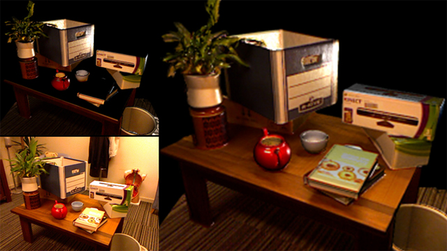

# Real Time Monocular 3D Reconstruction

This book summarizes the knowledge acquired along the development activities performed along the writing and development of my PhD Thesis research. It is written using the Markdown language extended with citation support in BibTex format from Pandoc, and compiled with Gitbook to simplify reading and publishing. The idea is that it could serve as a diary of research activities or a kind of progress report.

3D reconstruction from a single video stream (monocular camera) recover the depth of scene objects using information from consecutive frames. Our research aims to improve the accuracy and performance of the overall process introducing a feedback between the reconstruction and recognition phases.

At a first step, the research is focused only on interior scenes with closed loops using triangulation between different camera positions at a graph. Energy minimization techniques will be applied when possible

Results could be applied to medicine, architecture, forestry, robotics or audiovisual production, among others.

