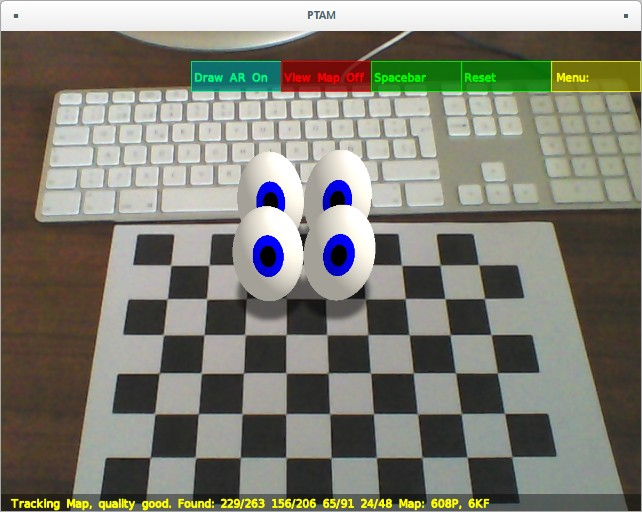
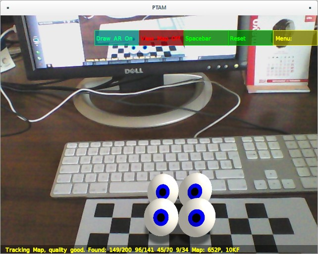
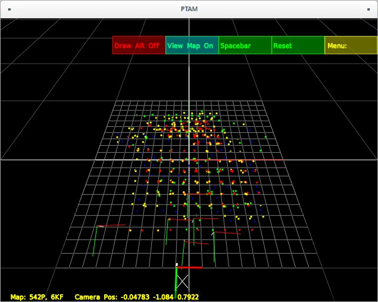
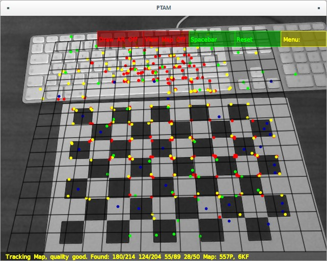

## April

This month has been affected by many holidays and non-lective days so the progress has been distributed accordingly into the other weeks which have less than 5 working days.

### 1st week

- Study of Structure from Motion open source solutions (too slow to run in real time)
  - [libmv](https://github.com/libmv/libmv) (used by Blender)
  - [OpenOF](https://github.com/OpenOF/OpenOF) [@wefelscheid2013openof] which uses GPU parallelization
- Quick Review of [Eigen3](http://eigen.tuxfamily.org) linear algebra library to solve optimization problems (used internally by OpenCV)
- Added OpenGL GLSL implementation for drawing video frames as texture in the background of the 3D viewport
  - Use of Qt 5.2 greatly simplifies the implementation of shader
  - Threaded execution: the tracking and the GUI now runs in separate threads

### 2nd and 3rd week

- Study of the Special Orthogonal Group in Lie Algebra for 3x3 rotation matrices
$$ R \in SO(3) \iff \left\vert R \right\vert = 1 $$
- Consider the use of [Sophus](https://github.com/strasdat/Sophus) library, a C++ implementation of Lie Groups using Eigen library
- Implementation of two Essential matrix solving methods:
 - Horn method from [@horn1990recovering]
 - Singular Value Decomposition from [@hartley2003multiple]

### 4th week

- Tested different camera setups to improve camera calibration
  - Results shown an acceptable mean reprojection error of 0.5 px
  - The literature suggest an error between 0.2 and 0.5

- Generation of documentation and progress report using Markdown syntax, GitBook and Pandoc to create this web book

- Testing GPL-2 version of PTAM implementation (taken from the fork of [Benjamin Lefaudeux](https://github.com/blefaudeux/PTAM-GPL)) described by @klein2007parallel
  - Here are some screenshoots taken from my compilation of the code

#### References