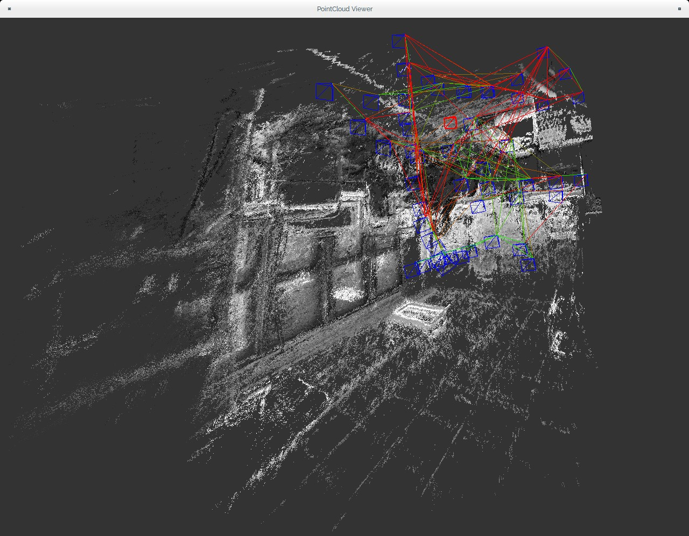
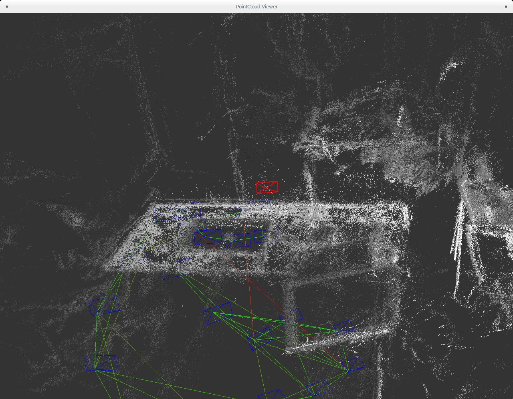
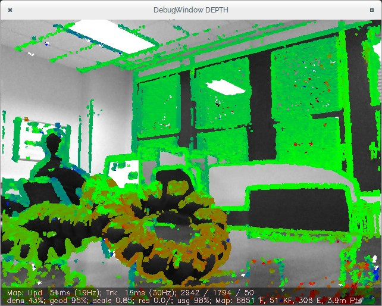
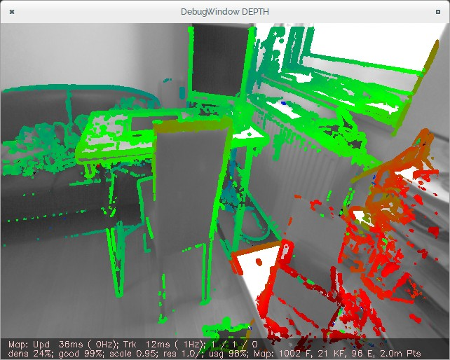

December
========

1st week
--------

-   Reviewing the slides to show the advances in the REACT project for
    the next week meeting (9th december)
-   Filling the PhD progress reports required by my University
-   Created a Gitbook account for allowing my tutor and cotutor to
    collaborate in this book in an easy way
-   Filling the gaps in this documentation. Joining the archives
    distributed across several private folders into a single public
    GitHub repository to simplify the book compilation and publishing in
    Gitbook

2nd week
--------

-   Working in integrating semi-dense depth maps into my current
    approach. In this way, the search of disparity can be done in real
    time with a single CPU core
-   Considering the Robot Operating System ([ROS](http://wiki.ros.org)) as an eventual layer over my OpenCV installation
-   Studying [ROS documentation and development manual](http://wiki.ros.org/ROS/Introduction)

3rd week
--------

- Setting up a [ROS workspace](http://wiki.ros.org/indigo/Installation/Source) over Ubuntu 15.04 using OpenCV 3.0
  - Chosen a `ros_comm` stack to support lsd_slam
  - Install some additional packages such as:
    1. [libuvc_camera](http://wiki.ros.org/libuvc_camera)
    2. [usb_cam](http://wiki.ros.org/usb_cam) (due to problems with libuvc_ros)
    2. [image_view](http://wiki.ros.org/image_view) (to view ROS topic in real-time)
  - Many problems with OpenCV 3.0 installation (need to recompile OpenCV using WITH_QT=NO)
  - Running ROS process with `rosrun <package> <executable>`
  - Checking ROS topics (such as usb camera stream) with `rostopic list`

- Making the first experiment with the original dataset and my creative HD webcam as a live camera. Results are the following ones:

