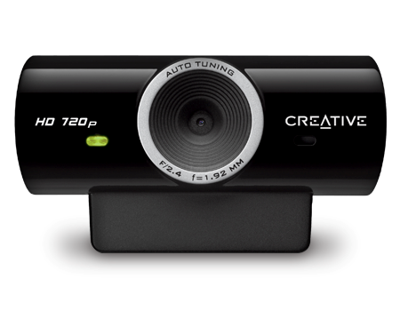

### 1st week

- Revision of the classic literature: the Bible of 3D Reconstruction by @hartley2003multiple
  - Fundamental matrix:

$$ \mathbf{x}'^T\mathbf{F}\mathbf{x} = \mathbf{0} $$

  - Essential matrix, considering the intrinsic parameters in $\mathbf{K}$:

$$ \mathbf{E} = \mathbf{K'^T}\mathbf{F}\mathbf{K} $$

- Revision of [Blender python API](http://www.blender.org/documentation/blender_python_api) taken into consideration to integrate PhD results with Blender

- Revision and compilation of [OpenCV](http://opencv.org) code, including CUDA 1.3 compilation for an old GTX 285
  - Using the 3.0 upcoming version from master branch with improved OpenCL support
  - More information at OpenCV [code page](http://code.opencv.org)

### 2nd week

- Installing a basic WebCam with a resolution of 1280x720


- Calibration using OpenCV [tool](http://docs.opencv.org/trunk/doc/tutorials/calib3d/camera_calibration/camera_calibration.html) based on @zhang2000flexible

- Searching for Open Source solutions to solve KLT traking
	- [GPU-KLT+FLOW](https://github.com/slowmoVideo/slowmoVideo/tree/master/src/V3D) from @zach2008fast
	- [CuKLT](http://tinyurl.com/kj73f2x) from @kim2009realtime
	- Study of the best GPU implementation in terms of performance (CUDA vs GLSL)

- Finally OpenCV's implementation of [goodFeaturesToTrack](http://docs.opencv.org/trunk/modules/imgproc/doc/feature_detection.html#goodfeaturestotrack) has been adopted since it is the simplest (just three basic methods) and the latest one of all
	- It is based on the method described by @shi1994good

``` cpp
cv::goodFeaturesToTrack(curFrame, curPts, npoints, 0.001, minDist);
cv::cornerSubPix(curFrame, curPts, cv::Size(subPixWinSize, subPixWinSize), cv::Size(-1,-1), termcrit);
cv::calcOpticalFlowPyrLK(prevFrame, curFrame, prevPts, curPts, status, err, cv::Size(winSize, winSize), 3, termcrit, 0, 0.001);
```

### 3rd and 4th week

- Starting the creation of a source code project
	- Creating a Git repository to maintain control version
- Learning and using CMake project configuration to manage dependecies and compile sources
	- Used by the most popular open source projects such as OpenCV, PCL and Blender
- Adquisiton of basic dataset to test video tracking

#### References
