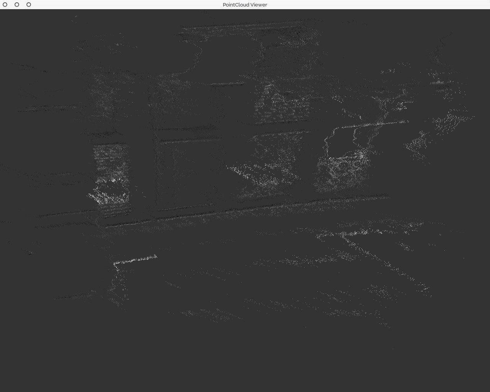
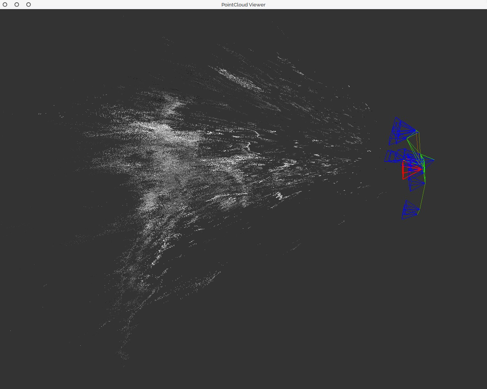
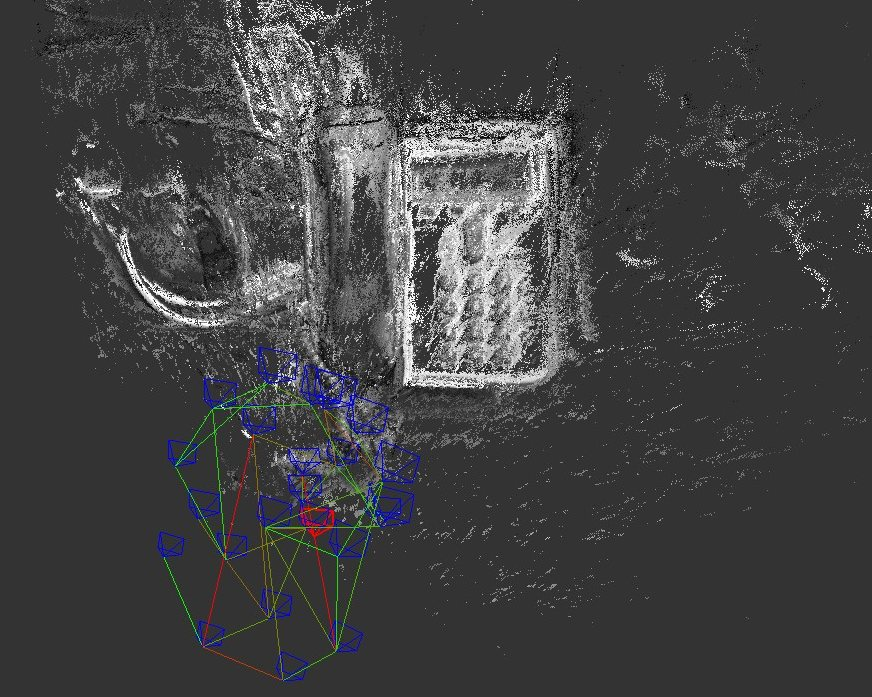

January
=======

1st week
--------

-   Still at Christmas's holidays!

2nd week
--------

-   Importing `lsd_slam` code into QtCreator for better code navigation
    and understanding
-   Breaking `lsd_slam` module into small reusable pieces of code for a
    semi-dense map reconstruction
-   Removing ROS dependencies from the code.
-   Adjusting ATAN camera calibration computed by PTAM using the following
    parameters: `[ 0.507403 0.731726 0.449718 1.00829 0.0278688 ]`
-   Created a little [roslaunch](http://wiki.ros.org/roslaunch/XML) file
    to automate the execution of the mapper and viewer in a single
    command:

<!-- -->

    <launch>
    <node name="webcam" pkg="usb_cam" type="usb_cam_node" output="screen" >
    <param name="video_device" value="/dev/video0" />
    <param name="image_width" value="640" />
    <param name="image_height" value="480" />
    <param name="pixel_format" value="mjpeg" />
    <param name="camera_frame_id" value="usb_cam" />
    <param name="io_method" value="mmap"/>
    </node>
    <node name="mapper" pkg="lsd_slam_core" type="live_slam" respawn="false" output="screen">
    <remap from="image" to="/usb_cam/image_raw" />
    <param name="calib" value="creative_hd_webcam.cfg" />
    </node>
    <node name="viewer" pkg="lsd_slam_viewer" type="viewer" respawn="false" output="screen" />
    </launch>

3rd week
--------

-   Fixed the issue at compiling with catkin support thanks to the patch in
    CMakeList.txt and the new folder layout of the `refine-devel` branch
    of a [fork](https://github.com/flluo/lsd_slam.git) of lsd_slam
-   Recompile image_pipeline avoiding unnecessary GTK2 dependencies which mix symbols with GTK3
-   QGLViewer is recompiled with support for Qt5 (the version in the Ubuntu repositories is still dependent of Qt4)
    -   Still having issues in the function qRegisterResourceData during
        Qt5 initialization
    -   Moving again to `origin` remote version of `lsd_slam_viewer`,
        but using the patched version of CMakeLists.txt from the forked
        repository
-   Issue with generated point clouds: degenerates in camera vision ray, probably due to camera noise at computing depth map

    
    

-   Recalibrate webcam with smaller (so better) mean reprojection error than before (0.33), but a different estimated focal length (766.44 pixels)
    -   Focal length in mm can be computed as $f = fx / mx$, where $mx$ is the number of pixels per millimeter (CCD width)
-   Increasing cameraPixelNoise mask to 8x8 (and minUseGrad too) to correct the noise of the webcam and avoid cloud degeneration along the vision ray

4rd week
--------

- Adding clarifications in the technical documentation according to the suggestions of Javier Finat (thanks!)
- Changed calibration configuration to ATAN camera model results in a point cloud with better borders but the depth computation is still buggy. Sometimes the tracker fails to recover the previous camera position without closing the loop.

- Correcting OpenCV practices written un Python of my students. This is the first time I can evaluate someone's work!

### References
