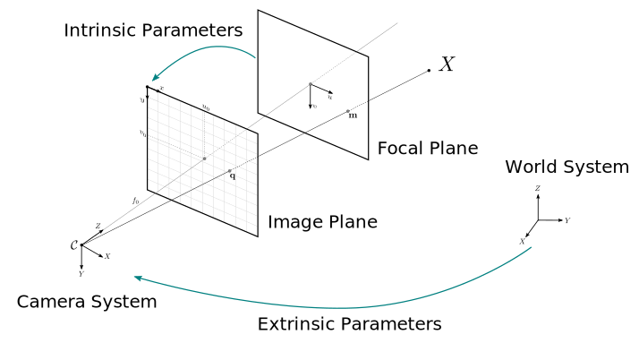

# Pinhole camera model

A camera can be approximated by a projective model. We use the classic pinhole projection which models how a 3D world point is projected over the image plane of the camera. The camera is modeled as a light sensible surface composed by the following elements:

- an image plane where the image is discretized in pixels
- a focal plane, in which the image is projected
- a lens with a focal length, center of projection and radial and barrel distortions
- a camera frame, with a position and orientation in space

The projection is represented by two set of parameters called intrinsic and extrinsic parameters. Intrinsic parameters allows to model the optic component considering distortions and aberrations introduced by the lens in the image. Extrinsic parameters represent the camera position and orientation. Then, the projection matrix $\mathbf{P}$ can be decomposed into two basic matrices:

$$ \mathbf{P}_{3 \times 4} = \left[ \begin{matrix} f*k_u & 0 & u_0 \\ 0 & f*k_v & v_0 \\ 0 & 0 & 1 \end{matrix} \right] * \left[ \begin{matrix} & & & t_x \\ & \mathbf{R}_{3 \times 3} & & t_y \\ & & & t_z \\ 0 & 0 & 0 & 1 \end{matrix} \right] $$

In a more compact matrix notation:

$$ x_i = P X_i = K [R|t] X_i $$

## Intrinsic parameters

The calibration matrix of a camera $\mathbf{K}$ is expressed in terms of the intrinsic parameters of that camera:

$$ \mathbf{K} = \left[ \begin{matrix} f*k_u & 0 & u_0 \\ 0 & f*k_v & v_0 \\ 0 & 0 & 1 \end{matrix} \right] $$

- $k_u, k_v$ is the scale factor relating pixels to distance (often equal to 1)
- $f$ (the focal length) is the focal distance between focal and image plane
- $u_0, v_0$ is the principal point (ideally in the center of the image)

The calibration matrix allows to establish a relation between the fundamental matrix $\mathbf{F}$ and the essential matrix $\mathbf{E}$ according to @hartley2003multiple

$$ \mathbf{E} = \mathbf{K}'^{\top} \mathbf{F} \mathbf{K} $$

## Extrinsic parameters

- $R$ is the rotation of the camera in space
- $t$ is the translation of the camera
- $C$ is the position of the camera in world coordinates

$$ C = −R^{-1}t = −R^{\top}t $$

## Calibration

Intrinsics parameters for a given camera can be computed using the algorithm from @zhang2000flexible implemented by OpenCV. Lens transforms a point $r$ in the theoretical image plane into a point $r'$ over the real image plane according to the FOV-model as it was explained by @devernay2001straight. The next equations describe how distortions affect pixel coordinates:

$$ \mathbf{P} \left(\begin{array}{c} x \\ y \\ z \\ 1 \end{array} \right) = \left(\begin{array}{c} u_0 \\ v_0 \end{array} \right) + \left[\begin{array}{cc} f_u & 0 \\ 0 & f_v \end{array} \right]\frac{r'}{r} \left(\begin{array}{c} x/z \\ y/z \end{array} \right)$$
$$ r = \sqrt{\frac{x^2 + y^2}{z^2}} $$
$$ r' =\frac{1}{w} \arctan(2r\tan{\frac{w}{2}}) $$

## Disparity to depth matrix

There is $4 \times 4$ matrix which allows to recover the world 3D point from the image pixels $(x, y)$ combined with the $d$ obtained from the disparity map calculated with stereo correspondence.

$$
\mathbf{p} = \left[\begin{array}{cccc}
1 & 0 & 0 & -c_x \\
0 &1 & 0 & -c_y \\
0 & 0 & 0 & f \\
0 & 0 &-1/T_x & (c_x - c_x')/T_x
\end{array} \right]
\left[\begin{array}{c}
x \\ y \\ d \\ 1
\end{array} \right]
$$

where $(c_x, c_y)$ is the principal point of the camera, $T_x$ is the baseline between the two cameras and $f$ is the focal length in mm.

### References
